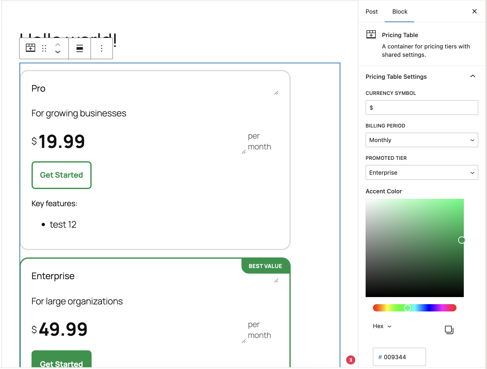
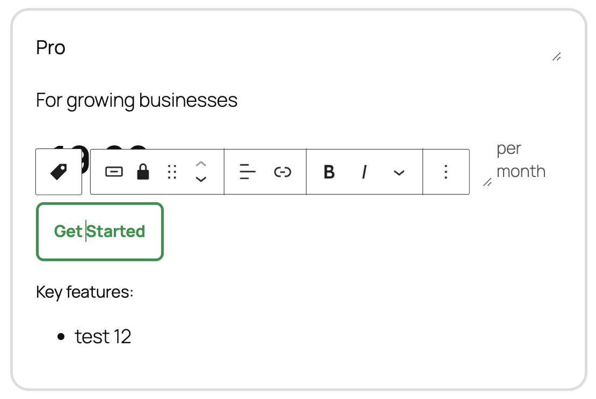
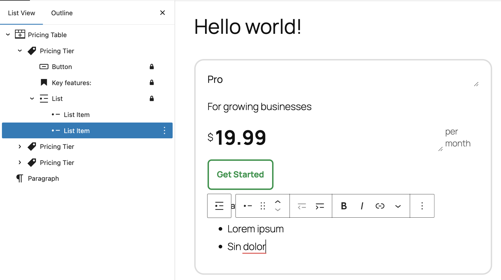

# Pricing Table Plugin

A modern WordPress block plugin for creating customizable pricing tables using
nested block architecture with WordPress core blocks.

## Architecture

Uses WordPress Block API v3 with `providesContext`/`usesContext` pattern.
Container block manages global settings (currency, billing, colors, promoted
tier) while individual tier blocks handle content through WordPress core
blocks.

**Blocks:**
- `pricing-table-plugin/pricing-table` - Container with global settings:
  currency, billing (monthly/yearly), color.
- `pricing-table-plugin/pricing-tier` - Individual tier with 

## Usage







## File Structure

The plugin is organized within the `pricing-table-plugin/` directory containing
all WordPress plugin files. Block definitions are located in `src/blocks/` with
separate folders for each block type (pricing-table and pricing-tier). The
`build/` directory contains all compiled assets.

## Development

```bash
docker compose up    # WordPress on localhost:8080
npm install          # Install dependencies
npm start            # Development mode
npm run build        # Production build
npm test             # E2E tests with Playwright
```

## Installation

Upload via WordPress Dashboard → Plugins → Add New, or extract to
`wp-content/plugins/` and activate.
